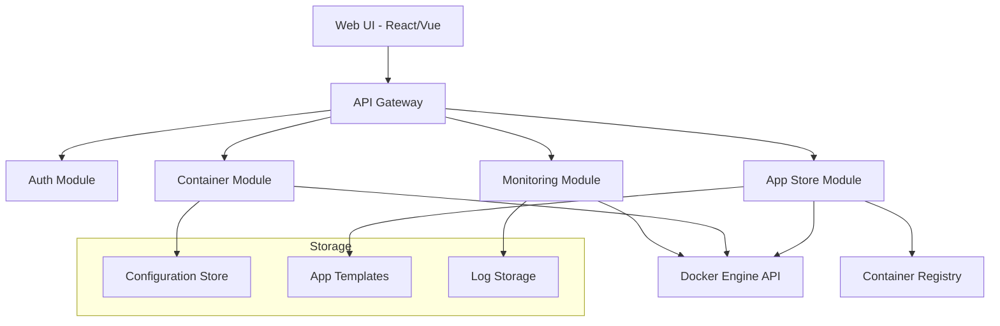

# Design Document

## Overview

The Docker Container Manager is a modular web-based platform that provides an intuitive interface for managing Docker containers with app store functionality. The system follows a microservices-inspired architecture with clear separation of concerns, enabling easy extension and maintenance.

The core design principles are:
- **Modularity**: Plugin-based architecture allowing feature extensions
- **Minimalism**: Clean, focused code with single-responsibility components  
- **Modern Stack**: Leveraging contemporary web technologies and patterns
- **API-First**: RESTful API design enabling future integrations

## Architecture

### High-Level Architecture



### Technology Stack

**Backend:**
- **Runtime**: Node.js with TypeScript
- **Framework**: Express.js with modular routing
- **Docker Integration**: dockerode library for Docker API communication
- **Storage**: SQLite for configuration, file system for templates and logs
- **WebSocket**: Socket.io for real-time updates

**Frontend:**
- **Framework**: React with TypeScript
- **State Management**: Zustand (lightweight alternative to Redux)
- **UI Components**: Tailwind CSS with Headless UI
- **Real-time**: Socket.io client

**Infrastructure:**
- **Containerization**: Docker for deployment
- **Process Management**: PM2 for production
- **Reverse Proxy**: Nginx (optional, for production)

## Components and Interfaces

### Core Modules

#### 1. API Gateway (`src/api/`)
Central routing and middleware handling for all HTTP requests.

```typescript
interface APIModule {
  registerRoutes(router: Router): void;
  middleware?: RequestHandler[];
}
```

#### 2. Container Module (`src/modules/containers/`)
Manages Docker container lifecycle operations.

```typescript
interface ContainerService {
  list(): Promise<Container[]>;
  create(config: ContainerConfig): Promise<Container>;
  start(id: string): Promise<void>;
  stop(id: string): Promise<void>;
  remove(id: string): Promise<void>;
  getLogs(id: string, options?: LogOptions): Promise<string[]>;
  getStats(id: string): Promise<ContainerStats>;
}
```

#### 3. App Store Module (`src/modules/appstore/`)
Handles application templates and deployment workflows.

```typescript
interface AppStoreService {
  getApps(category?: string): Promise<App[]>;
  searchApps(query: string): Promise<App[]>;
  getAppDetails(id: string): Promise<AppDetails>;
  deployApp(appId: string, config: DeployConfig): Promise<Container>;
}
```

#### 4. Monitoring Module (`src/modules/monitoring/`)
Provides container metrics and health monitoring.

```typescript
interface MonitoringService {
  getContainerMetrics(id: string): Promise<Metrics>;
  getSystemMetrics(): Promise<SystemMetrics>;
  streamLogs(id: string): EventEmitter;
  checkHealth(id: string): Promise<HealthStatus>;
}
```

#### 5. Configuration Module (`src/modules/config/`)
Manages system and container configurations.

```typescript
interface ConfigService {
  getContainerConfig(id: string): Promise<ContainerConfig>;
  saveContainerConfig(id: string, config: ContainerConfig): Promise<void>;
  exportConfig(id: string): Promise<string>;
  importConfig(configData: string): Promise<ContainerConfig>;
}
```

### Plugin System

The modular architecture supports plugins through a standardized interface:

```typescript
interface Plugin {
  name: string;
  version: string;
  initialize(context: PluginContext): Promise<void>;
  routes?: APIModule;
  uiComponents?: UIComponent[];
}
```

## Data Models

### Container Configuration
```typescript
interface ContainerConfig {
  id: string;
  name: string;
  image: string;
  tag: string;
  environment: Record<string, string>;
  ports: PortMapping[];
  volumes: VolumeMapping[];
  networks: NetworkConfig[];
  restartPolicy: RestartPolicy;
  resources: ResourceLimits;
  healthCheck?: HealthCheck;
  security?: SecurityOptions;
}

interface PortMapping {
  hostPort: number;
  containerPort: number;
  protocol: 'tcp' | 'udp';
  description?: string;
}

interface VolumeMapping {
  hostPath: string;
  containerPath: string;
  mode: 'ro' | 'rw';
  description?: string;
}

```

### Application Template
```typescript
interface AppTemplate {
  id: string;
  name: string;
  description: string;
  category: string;
  icon: string;
  version: string;
  image: string;
  defaultConfig: Partial<ContainerConfig>;
  configSchema: JSONSchema;
  documentation: string;
}
```

### Container Runtime Data
```typescript
interface Container {
  id: string;
  name: string;
  status: 'running' | 'stopped' | 'paused' | 'restarting';
  image: string;
  created: Date;
  ports: PortMapping[];
  volumes: VolumeMapping[];
  stats?: ContainerStats;
}

interface ContainerStats {
  cpu: number;
  memory: MemoryStats;
  network: NetworkStats;
  disk: DiskStats;
}
```

## Error Handling

### Error Categories
1. **Docker API Errors**: Connection issues, invalid operations
2. **Validation Errors**: Invalid configuration, missing required fields
3. **Resource Errors**: Insufficient resources, port conflicts
4. **System Errors**: File system issues, permission problems

### Error Response Format
```typescript
interface ErrorResponse {
  error: {
    code: string;
    message: string;
    details?: any;
    timestamp: string;
  };
}
```

### Error Handling Strategy
- **API Level**: Centralized error middleware with consistent response format
- **Service Level**: Specific error types with context information
- **UI Level**: User-friendly error messages with actionable suggestions
- **Logging**: Structured logging with error tracking and metrics

## Testing Strategy

### Unit Testing
- **Framework**: Jest with TypeScript support
- **Coverage**: Minimum 80% code coverage for core modules
- **Mocking**: Docker API mocked for isolated testing
- **Structure**: Tests co-located with source files (`*.test.ts`)

### Integration Testing
- **Docker Integration**: Test against real Docker daemon in CI
- **API Testing**: Supertest for HTTP endpoint testing
- **Database Testing**: In-memory SQLite for fast test execution

### End-to-End Testing
- **Framework**: Playwright for browser automation
- **Scenarios**: Critical user workflows (deploy, manage, monitor)
- **Environment**: Docker Compose for test environment setup

### Testing Structure
```
src/
├── modules/
│   ├── containers/
│   │   ├── container.service.ts
│   │   ├── container.service.test.ts
│   │   └── container.integration.test.ts
│   └── ...
├── __tests__/
│   ├── e2e/
│   └── fixtures/
└── test-utils/
```

## Security Considerations

### Authentication & Authorization
- JWT-based authentication for API access
- Role-based access control (admin, user, readonly)
- Session management with secure cookies

### Docker Security
- Docker socket access restricted to application user
- Container resource limits enforced
- Network isolation for sensitive containers
- Image vulnerability scanning integration

### API Security
- Rate limiting on API endpoints
- Input validation and sanitization
- CORS configuration for web UI
- HTTPS enforcement in production

## Performance Optimization

### Caching Strategy
- Container status cached with TTL
- App templates cached in memory
- Docker API responses cached for non-critical data

### Real-time Updates
- WebSocket connections for live container status
- Event-driven updates to reduce polling
- Efficient diff algorithms for UI updates

### Resource Management
- Connection pooling for Docker API
- Lazy loading of container logs and metrics
- Pagination for large container lists